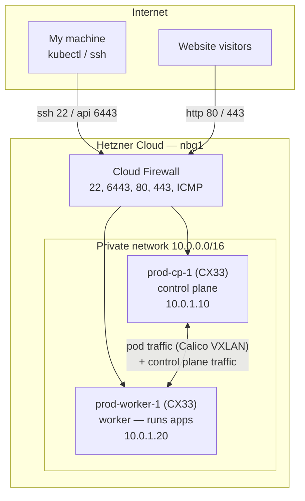

# k8s-cluster-hetzner

Production Kubernetes cluster on Hetzner Cloud, built from scratch with kubeadm.
Hosts my personal website and habit/study-tracker application.

> A separate cluster (different repo/project) is used for cert practice and
> experimentation — this one stays stable.

## Cluster at a glance

| | |
|---|---|
| Provider | Hetzner Cloud, Nuremberg (`nbg1`) |
| Nodes | 2× CX33 (4 vCPU, 8 GB RAM, 80 GB NVMe, x86_64) |
| OS | Ubuntu 24.04 LTS |
| Kubernetes | vanilla kubeadm, single control plane + 1 worker |
| Container runtime | containerd (systemd cgroups) |
| CNI | Calico (VXLAN encapsulation) |
| Provisioning | Terraform (servers, private network, firewall, SSH key) |
| Configuration | Ansible (deploy user, hardening, kubeadm bootstrap) |
| Workloads | Kustomize + kubectl (GitOps planned later) |
| Cost | ~$19/mo (2× $8.99 servers + 2× ~$0.60 IPv4) |

## Architecture



The Hetzner firewall only filters the **public** interfaces. Node-to-node
traffic (etcd, kubelet, Calico VXLAN) flows over the private network and is
not firewalled — which is what we want.

## Repository layout

```
terraform/     Infrastructure: servers, network, firewall, SSH key
ansible/       Server config + cluster bootstrap (playbooks run in order 01→04)
kubernetes/    Kustomize manifests: cluster add-ons and application workloads
docs/          Step-by-step guides, decision log, operations runbook
```

## Build order (fresh start → running apps)

Each step has a full guide in `docs/`:

1. [Prerequisites](docs/00-prerequisites.md) — WSL tooling, Hetzner API token, SSH key
2. [Provision infrastructure](docs/01-provision-infrastructure.md) — `terraform apply`
3. [Configure servers](docs/02-configure-servers.md) — Ansible: deploy user, hardening, k8s prep
4. [Bootstrap the cluster](docs/03-bootstrap-cluster.md) — kubeadm init/join, Calico, kubeconfig
5. [Deploy workloads](docs/04-deploy-workloads.md) — Kustomize apps

Also see the [decision log](docs/decisions.md) for *why* each choice was made,
and the [runbook](docs/runbook.md) for day-2 operations.

## Quick reference

```bash
# From WSL, repo root
cd terraform && terraform apply           # create/modify infrastructure
cd ansible && ansible-playbook playbooks/site.yml   # converge everything
kubectl get nodes -o wide                 # check cluster health
```
