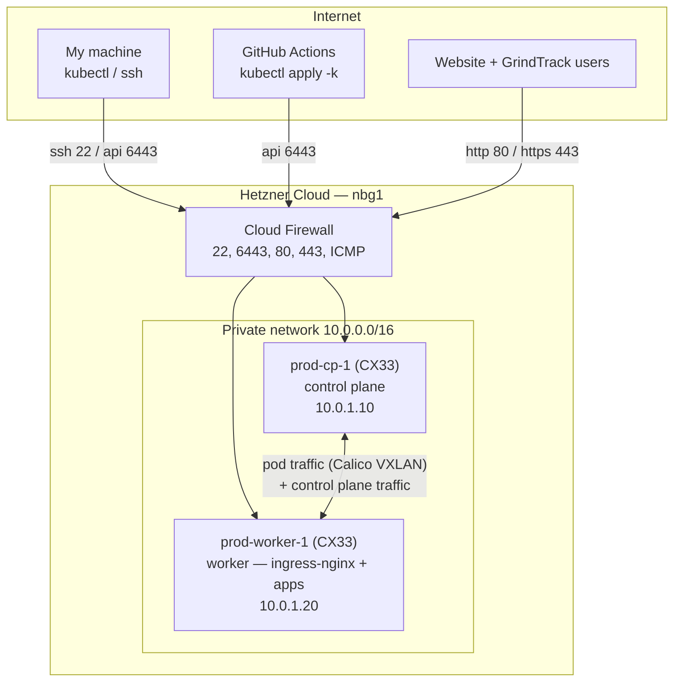

# k8s-cluster-hetzner

Production Kubernetes cluster on Hetzner Cloud, built from scratch with
kubeadm. It runs my personal website (`caseyrquinn.com`) and **GrindTrack**
(`track.caseyrquinn.com`), both migrated here from a single VPS, with TLS from
Let's Encrypt.

The same repo holds a disposable **CKAD practice lab** under `practice/` that
reuses the production Ansible roles — separate Terraform state, separate
network, own kubeconfig, torn down after each session. Production stays
stable; the lab is where things get broken on purpose.

## Cluster at a glance

| | |
|---|---|
| Provider | Hetzner Cloud, Nuremberg (`nbg1`) |
| Nodes | 2× CX33 (4 vCPU, 8 GB RAM, 80 GB NVMe, x86_64) |
| OS | Ubuntu 24.04 LTS |
| Kubernetes | vanilla kubeadm 1.33, single control plane + 1 worker |
| Container runtime | containerd (systemd cgroups) |
| CNI | Calico (VXLAN encapsulation) |
| Ingress | ingress-nginx, bound to 80/443 on the worker |
| TLS | cert-manager + Let's Encrypt (`ClusterIssuer`) |
| Storage | local-path-provisioner as the default StorageClass (database PVCs) |
| Provisioning | Terraform (servers, private network, firewall, SSH key) |
| Configuration | Ansible (deploy user, hardening, kubeadm bootstrap) |
| Workloads | Kustomize + kubectl; GitHub Actions deploys through a namespaced ServiceAccount |
| Cost | ~$19/mo (2× $8.99 servers + 2× ~$0.60 IPv4) |

## Architecture



The Hetzner firewall only filters the **public** interfaces. Node-to-node
traffic (etcd, kubelet, Calico VXLAN) flows over the private network and is
not firewalled — which is what we want. DNS A records point at the worker's
public IP, where ingress-nginx listens.

## What runs on it

| Namespace | Workloads | Reachable as |
|---|---|---|
| `personal-website` | frontend, backend, Postgres, Redis | `caseyrquinn.com`, `api.caseyrquinn.com` |
| `grindtrack` | GrindTrack app, Postgres | `track.caseyrquinn.com` |
| `ingress-nginx` | ingress controller | 80/443 on the worker |
| `cert-manager` | certificate issuance and renewal | — |
| `local-path-storage` | `local-path` StorageClass (default) | — |

Application manifests live in `kubernetes/apps/<app>/base` with a
`overlays/prod` per app; cluster foundations in `kubernetes/cluster/`.
Secrets (app credentials, the GHCR pull secret) are created by hand with
`kubectl create secret` and are never committed — see
[docs/05-app-migration.md](docs/05-app-migration.md) for the exact commands.

## Repository layout

```
terraform/     Infrastructure: servers, network, firewall, SSH key
ansible/       Server config + cluster bootstrap (playbooks run in order 01→04)
kubernetes/    Kustomize manifests
  cluster/       namespaces, ingress-nginx, cert-manager, local-path-storage, ci-deployer RBAC
  apps/          personal-website/, grindtrack/  (base + overlays/prod each)
scripts/       gen-ci-kubeconfig.sh — kubeconfig for the GitHub Actions deployer
docs/          Step-by-step guides, decision log, operations runbook
practice/      CKAD practice lab: own Terraform/Ansible, exam-style scenario sets
```

## Build order (fresh start → running apps)

Each step has a full guide in `docs/`:

1. [Prerequisites](docs/00-prerequisites.md) — WSL tooling, Hetzner API token, SSH key
2. [Provision infrastructure](docs/01-provision-infrastructure.md) — `terraform apply`
3. [Configure servers](docs/02-configure-servers.md) — Ansible: deploy user, hardening, k8s prep
4. [Bootstrap the cluster](docs/03-bootstrap-cluster.md) — kubeadm init/join, Calico, kubeconfig
5. [Deploy workloads](docs/04-deploy-workloads.md) — foundations and Kustomize basics
6. [Migrate the apps](docs/05-app-migration.md) — storage, cert-manager, secrets, databases, DNS flip (the order that was actually used)

Also see the [decision log](docs/decisions.md) for *why* each choice was made,
and the [runbook](docs/runbook.md) for day-2 operations (patching, upgrades,
certificates, node loss, teardown).

## Deploying application changes

Each app repository has a GitHub Actions workflow that runs
`kubectl apply -k kubernetes/apps/<app>/overlays/prod` against this cluster.
It authenticates as a `ci-deployer` ServiceAccount that can only touch its
own namespace ([kubernetes/cluster/ci-deployer](kubernetes/cluster/ci-deployer/README.md));
the kubeconfig it uses comes from:

```bash
./scripts/gen-ci-kubeconfig.sh grindtrack     # prints base64 for the KUBE_CONFIG repo secret
```

Manual deploys and previews work the same way from WSL:

```bash
kubectl kustomize kubernetes/apps/grindtrack/overlays/prod     # render only
kubectl apply -k kubernetes/apps/grindtrack/overlays/prod
kubectl -n grindtrack rollout status deploy/grindtrack
```

## Quick reference

```bash
# From WSL, repo root
cd terraform && terraform apply                       # create/modify infrastructure
cd ansible && ansible-playbook playbooks/site.yml     # converge everything
kubectl get nodes -o wide                             # check cluster health
kubectl get ingress,certificate -A                    # hosts and TLS status
```

`kubectl config current-context` should read `kubernetes-admin@prod` before
any of that — the practice lab has its own context, `kubernetes-admin@lab`.

## Practice lab

`practice/` spins up a second, throwaway 2-node cluster (2× CX23, hourly
billing) with the same roles, plus exam-style scenario sets: `setup.sh`
builds a question's starting state, `TASK.md` is the assignment, `verify.sh`
scores it. Sets 2 (topic gaps) and 4 (Helm + Kustomize) are original and
committed; sets 1 and 3 are killer.sh rebuilds and stay local. Start with
[practice/README.md](practice/README.md).

## What is never committed

Terraform state, kubeconfigs, the generated Ansible inventory (server IPs),
`terraform.tfvars`, database dumps, and any Kubernetes Secret manifest. The
Hetzner API token lives only in the `HCLOUD_TOKEN` environment variable.
See `.gitignore` for the full list.
